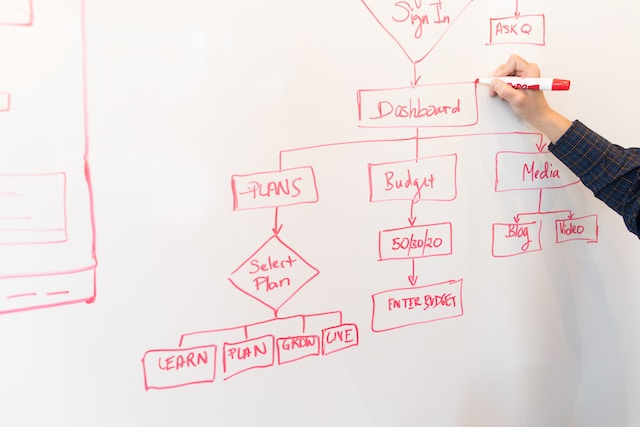
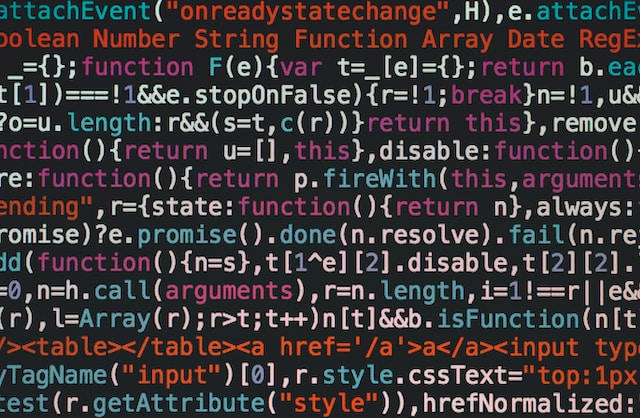
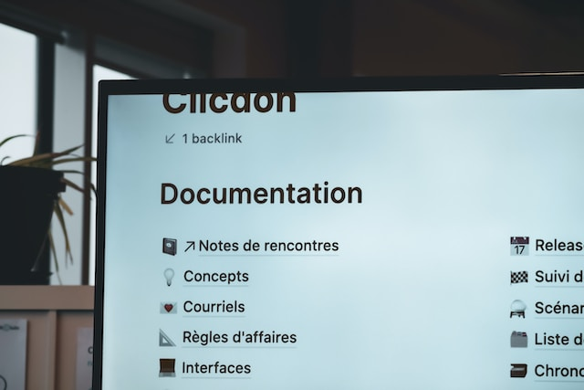

# Etapas de desarrollo de software
1. [Análisis de requisitos](#analisis-de-requisitos)
2. [Diseño](#diseño)
3. [Codificación y compilación](#codificación-y-compilación)
4. [Pruebas](#pruebas)
5. [Explotación](#explotación)
6. [Mantenimiento](#mantenimiento)
7. [Documentación](#documentación)
8. [Video](#video)

### Analisis de requisitos 

Un análisis de requerimientos es **un estudio profundo de una necesidad tecnológica** que tiene una empresa, organización o negocio.

En este proceso, se realiza un análisis exhaustivo del sistema que se va a desarrollar.  Se definen y aplican técnicas que permitan analizar los requisitos necesarios para su buen desarrollo. 

De esta forma, se logra reconocer y entender cuáles son las verdaderas necesidades que el sistema debe solucionar. 

* **Requisitos funcionales**

  > Los requisitos funcionales se componen de dos partes: función y comportamiento. La función es lo que hace el sistema (por ejemplo, "calcular el impuesto sobre las ventas"). El comportamiento es cómo lo hace el sistema (p. ej., "El sistema calculará el impuesto sobre las ventas multiplicando el precio de compra por la tasa impositiva").
* **Requisitos no funcionales**
    > Los requisitos no funcionales explican las limitaciones y restricciones del sistema a diseñar. Estos requisitos no tienen ningún impacto en la funcionalidad de la aplicación. Además, existe una práctica común de subclasificar los requisitos no funcionales en varias categorías, como:
    Interfaz de usuario
    Confiabilidad 
    Seguridad
    Rendimiento
    Mantenimiento
    Estándares 

### Diseño

Implica tareas que van desde la investigación de lo que la gente quiere, hasta diseñar y probar los prototipos. El diseño de productos consiste en comprender lo que la gente necesita y quiere y, a continuación, crear un producto que satisfaga ese deseo.

#### Fases de diseño

|| Fases |
|:---:|:---:|
| 1 | Investigación y descubrimiento |
| 2 | Ideación y conceptualización |
| 3 | Desarrollo del diseño |
| 4 | Creación de prototipos |
| 5 | Pruebas y validación |
| 6 | Fabricación y lanzamiento |

### Codificación y compilación

Siguiente paso es el de la codificación, es decir, transcribir el pseudocódigo o pasar el diagrama a código fuente. Para saber escribirlo, debes conocer a fondo el lenguaje de programación que estés usando. En este caso, sí que es un código comprensible por el compilador o el IDE que estemos usando. Un ejemplo de código ya codificado sería el ejemplo Hola mundo en C que hay sobre este mismo párrafo

### Pruebas

Una aplicación está lista para probar una vez que el equipo haya terminado con todas las fases anteriores. Según el plan de prueba, los evaluadores ejecutan casos de prueba. También identifican, detectan y registran los defectos, informando así los errores. El equipo también es responsable de comparar los resultados esperados con el resultado real. Si se encuentra algún error, es necesario documentarlo para transmitirlo al equipo de desarrollo para que lo solucione. 

#### Tipos de pruebas

* **Unitarias**: Una prueba unitaria de software —también conocida como unit testing— es el instrumento utilizado para validar un fragmento de código fuente. Los desarrolladores aíslan una línea del lenguaje codificado para saber si el sistema está operando correctamente en una función, proceso o actividad específica.
* **De integración**: Las pruebas de integración o pruebas integradas se definen como un mecanismo de testeo de software, donde se realiza un análisis de los procesos relacionados con el ensamblaje o unión de los componentes, sus comportamientos con múltiples partes del sistema (ya sea de archivos operativos) o de hardware, entre otras.

### Explotación

La explotación es la última etapa del ciclo de desarrollo de software lineal. Comprende las fases de instalación y aceptación.

### Mantenimiento

Las llamadas fases de mantenimiento y evolución que en otros modelos de ciclos, tienen sus propias fases, aquí hemos decidido englobarlas en Explotación, puesto que es lo se que está haciendo y consideramos que son parte de esta última fase del ciclo que puede mantenerse por años.

### Documentación

La documentación es otra etapa importante del desarrollo de software. Se trata de la elaboración de documentos que especifican el funcionamiento del programa y sirven de soporte tanto para el desarrollador como para el usuario. La documentación transparente del código de fuente del programa es un punto fundamental del desarrollo.

### Video

