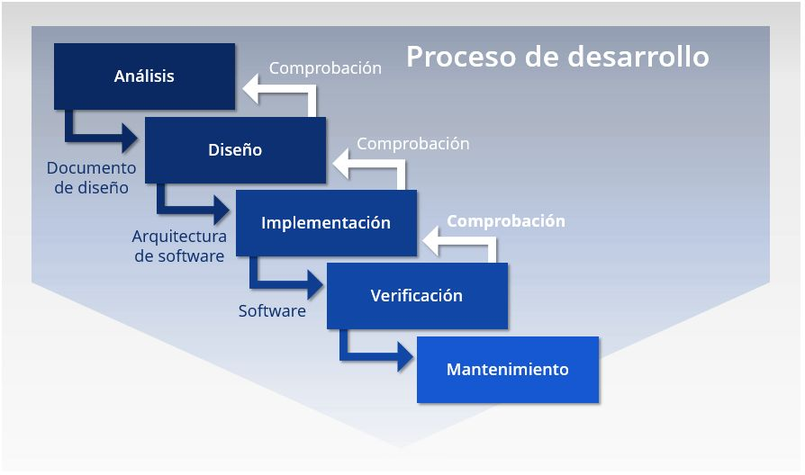

# Ciclos de vida de software
## Indice
* [Modelos de desarrollo](#modelos-de-desarrollo)
* [Modelo en cascada](#modelo-en-cascada)
* [Modelo en cascada con realimentación](#modelo-en-cascada-con-realimentación)
* [Modelos evolutivos](#modelos-evolutivos)
    * [Modelo interactivo incremental](#modelo-interactivo-incremental)
    * [Modelo en espiral](#modelo-en-espiral)
    * [Modelos Ágiles](#modelos-ágiles)
* [Video](#video)
## Modelos de desarrollo
Modelos de desarrollo de software son una colección de técnicas y sistemas organizacionales para crear software de computadora. El objetivo de los diversos enfoques es estructurar equipos de trabajo para que puedan construir las funcionalidades del programa de la manera más eficiente posible. Modelos de desarrollo de software proporcionar un marco para controlar el desarrollo de los sistemas de información. Desde la planificación hasta el mantenimiento, un Ciclo de vida del desarrollo de programas (SDLC) describe todos los procesos en un proyecto de desarrollo de software. Estos marcos incluyen el desarrollo de programas, así como las herramientas necesarias para ayudar en el proceso de desarrollo.
### Modelo en cascada

El modelo de cascada es un método de gestión de proyectos, en el que el proyecto se divide en distintas fases secuenciales, donde el equipo puede pasar a la siguiente fase sólo cuando se haya completado la anterior. 

Las etapas de desarrollo:
1. Requisitos
2. Diseño y implementación
3. Pruebas
4. Implantación
5. Mantenemiento

### Modelo en cascada con realimentación

Sin embargo, el modelo cascada en algunas de sus variantes es uno de los actualmente más utilizados, por su eficacia y simplicidad, más que nada en software de pequeño y algunos de mediano porte; pero nunca (o muy rara vez) se lo usa en su «forma pura», como se dijo anteriormente. En lugar de ello, siempre se produce alguna realimentación entre etapas, que no es completamente predecible ni rígida; esto da oportunidad al desarrollo de productos software en los cuales hay ciertas incertezas, cambios o evoluciones durante el ciclo de vida. Así por ejemplo, una vez capturados y especificados los requisitos (primera etapa) se puede pasar al diseño del sistema, pero durante esta última fase lo más probable es que se deban realizar ajustes en los requisitos (aunque sean mínimos), ya sea por fallas detectadas, ambigüedades o bien por que los propios requisitos han cambiado o evolucionado; con lo cual se debe retornar a la primera o previa etapa, hacer los reajuste pertinentes y luego continuar nuevamente con el diseño; esto último se conoce como realimentación.

### Modelos evolutivos

Los evolutivos son modelos iterativos, permiten desarrollar versiones cada vez más completas y complejas, hasta llegar al objetivo final deseado; incluso evolucionar más allá, durante la fase de operación. 

#### Modelo interactivo incremental

El desarrollo iterativo y creciente (o incremental) es un proceso de desarrollo de software creado en respuesta a las debilidades del modelo tradicional de cascada.

Básicamente este modelo de desarrollo, que no es más que un conjunto de tareas agrupadas en pequeñas etapas repetitivas (iteraciones),1​ es uno de los más utilizados en los últimos tiempos ya que, como se relaciona con novedosas estrategias de desarrollo de software y una programación extrema, es empleado en metodologías diversas.

El modelo consta de diversas etapas de desarrollo en cada incremento, las cuales inician con el análisis y finalizan con la instauración y aprobación del sistema.

#### Modelo en espiral

El modelo de desarrollo en Espiral es una combinación entre el modelo waterfall y un modelo por iteraciones.

El proceso pasa por distintas etapas, desde la de conceptualización, siguiendo el desarrollo, luego una fase de mejoras, para finalizar con el mantenimiento.

Dentro de cada etapa, tendremos una serie de fases que transcurren desde la planificación, pasando por el análisis de riesgos, el desarrollo y finalizando en la evaluación de lo realizado. Se incorpora también una fase de enlace entre etapas, para facilitar la transición entre las mismas.

#### Modelos Ágiles

Su objetivo es satisfacer al cliente mediante la entrega constante e incremental de un producto que agregue valor, manteniendo una comunicación continua con el cliente y entre los miembros del equipo de trabajo.

Las metodologías ágiles no buscan entregar un producto completo, sino paso a paso.

De esta forma, se corrigen los desafíos de entregar productos en largos períodos de tiempo que enfrentan los enfoques tradicionales de cascada, con el riesgo de que los requisitos del cliente cambien con frecuencia, lo que significa que se le entregaría un producto incorrecto o deficiente.

### Video
