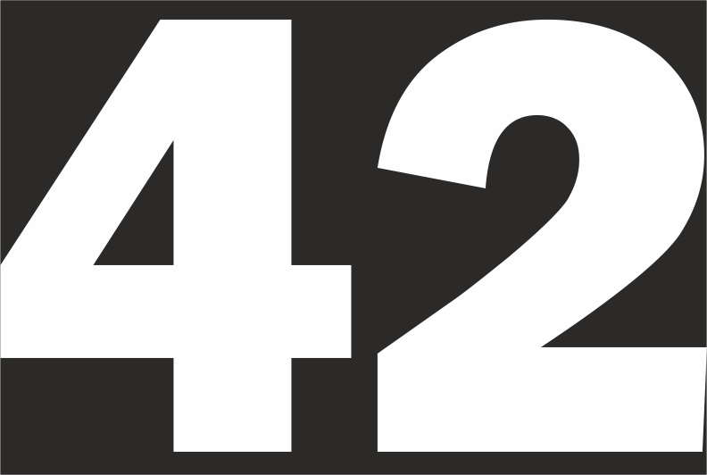

# Practica de ETS
## Markdown
Para realizar practica hay que crear un fichero README.md formateado con markdown


### Ejemplos del texto formateado

#### Lista ordenadas y desordenadas

1. Elemento de lista
    1. Subelemento de lista
2. Elemento de lista
3. Elemento de lista
---
* Elemento de lista
    * Subelemento de lista
* Elemento de lista
* Elemento de lista

#### Texto formateado

**bold**

*italic*

~~tachado~~

>cita


#### Bloques de codigo
<!-- generar una linea de código -->
---
`
console.log("hola mundo")
`
```xml
<?xml version="1.0" encoding="UTF-8"?>
<?xml-stylesheet type="text/xsl" href="artistas.xsl"?>
<artistas>
<artista cod="a101">
<nombreCompleto>Diego Velázquez</nombreCompleto>
<nacimiento>1599</nacimiento>
<fallecimiento>1660</fallecimiento>
<pais>España</pais>
<fichaCompleta>https://es.wikipedia.org/wiki/Diego_Vel%C3%A1zquez</fichaCompleta>
</artista>
```
```python
def run(values: list) -> tuple:
    max_value = values[0]
    min_value = values[0]
    for value in values:
        if value < min_value:
            min_value = value
        elif value > max_value:
            max_value = value

    return max_value, min_value


if __name__ == '__main__':
    run([4, 6, 2, 1, 9, 63, -134, 566])
```
<!-- Accesso a páginas web -->
---
[Periodico El Pais](https://elpais.com/ "Periodico chachi")

[Google](https://www.google.com/)

<!-- Accesso a imagenes -->




* [X] Tarea 1
* [X] Tarea 2
* [X] Tarea 3
* [ ] Tarea 4

#### Tablas

| Nombre | Apellidos |
|:---:|:---:|
| Alan | Wake |
