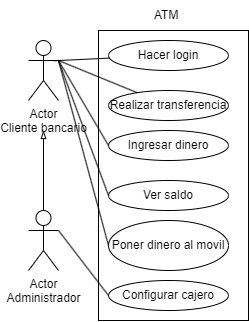

# Casos de uso de una biblioteca

## Especificacion de los actores
Actor|Administrador
---|---
Descripción|El actor Administrador representa a los usuarios con privilegios elevados que gestionan y supervisan el sistema del cajero automático.
Relaciones|Cliente bancario
Referencias|Hacer Login, Configurar Cajero
Autor|Inna Vdovitsyna
Fecha27/01/2024

Actor|Cliente bancario
---|---
Descripción|El actor Cliente bancario representa a los usuarios que utilizan el cajero automático para realizar operaciones bancarias.
Relaciones|Administrador
Referencias|Hacer Login, Realizar Transferencia, Ingresar Dinero, Ver Saldo, Poner Dinero al Móvil
Autor|Inna Vdovitsyna
Fecha27/01/2024

## Especificacion de los casos de Uso
Caso de Uso CU|Hacer Login
---|---
Fuentes|Diagrama de los casos del uso
Actor|Cliente bancario o Administrador
Descripción|Este caso de uso permite al cliente bancario o al administrador autenticarse en el sistema del cajero mediante un proceso de inicio de sesión.
**Flujo básico**|
1|El usuario introduce su tarjeta bancaria.
2|Ingresa su código PIN.
3|Se autentica en el sistema.
**Flujo Alternativo**|
3|Si la autenticación falla:
---|Muestra un mensaje de error indicando la naturaleza del problema.
---|Proporciona opciones para corregir el error o solicitar asistencia.
Pre-condiciones|La tarjeta bancaria debe ser válida, el código PIN debe ser correcto.
Post-condiciones|El usuario queda autenticado en el sistema.
Autor|Inna Vdovitsyna
Fecha27/01/2024

Caso de Uso CU|Realizar Transferencia
---|---
Fuentes|Diagrama de los casos del uso
Actor|Cliente bancario
Descripción|Este caso de uso permite al cliente bancario transferir fondos entre cuentas mediante el cajero automático.
**Flujo básico**|
1|El cliente bancario inicia sesión en el cajero.
2|Selecciona la opción "Realizar Transferencia".
3|Ingresa los detalles de la cuenta de destino y el monto a transferir.
4|Confirma la operación.
**Flujo Alternativo**|
4|Si la transferencia no se puede completar:
---|Muestra un mensaje de error indicando la naturaleza del problema.
---|Proporciona opciones para corregir el error o cancelar la transferencia.
Pre-condiciones|El cliente bancario debe estar autenticado en el sistema, deben haber fondos suficientes en la cuenta.
Post-condiciones|Se realiza la transferencia y se actualizan los saldos de las cuentas involucradas.
Autor|Inna Vdovitsyna
Fecha27/01/2024

Caso de Uso CU|Ingresar Dinero
---|---
Fuentes|Diagrama de los casos del uso
Actor|Cliente bancario
Descripción|Este caso de uso permite al cliente bancario depositar dinero en efectivo en su cuenta a través del cajero automático.
**Flujo básico**|
1|El cliente bancario inicia sesión en el cajero.
2|Selecciona la opción "Ingresar Dinero".
3|Inserta el dinero en el lector de billetes.
4|Confirma la cantidad ingresada.
**Flujo Alternativo**|
2|Si el ingreso de dinero no se puede completar:
---|Muestra un mensaje de error indicando la naturaleza del problema.
---|Proporciona opciones para corregir el error o cancelar la operación.
Pre-condiciones|El cliente bancario debe estar autenticado en el sistema, el cajero automático debe aceptar depósitos en efectivo.
Post-condiciones|El dinero ingresado se refleja en el saldo de la cuenta del cliente.
Autor|Inna Vdovitsyna
Fecha27/01/2024

Caso de Uso CU|Ver Saldo
---|---
Fuentes|Diagrama de los casos del uso
Actor|Cliente bancario
Descripción|Este caso de uso permite al cliente bancario consultar el saldo actual de su cuenta a través del cajero automático.
**Flujo básico**|
1|El cliente bancario inicia sesión en el cajero.
2|Selecciona la opción "Ver Saldo".
3|Visualiza el saldo actual de su cuenta en la pantalla del cajero.
**Flujo Alternativo**|
3|Si no se puede mostrar el saldo:
---|Muestra un mensaje de error indicando la naturaleza del problema.
---|Proporciona opciones para corregir el error o solicitar asistencia.
Pre-condiciones|El cliente bancario debe estar autenticado en el sistema
Post-condiciones| muestra el saldo actual de la cuenta del cliente.
Autor|Inna Vdovitsyna
Fecha27/01/2024

Caso de Uso CU|Poner Dinero al Móvil
---|---
Fuentes|Diagrama de los casos del uso
Actor|Cliente bancario
Descripción|Este caso de uso permite al cliente bancario cargar saldo en su teléfono móvil a través del cajero automático.
**Flujo básico**|
1|El cliente bancario inicia sesión en el cajero.
2|Selecciona la opción "Poner Dinero al Móvil".
3|Ingresa el número de teléfono móvil y el monto a cargar.
4|Confirma la operación.
**Flujo Alternativo**|
4|Si la carga de saldo no se puede completar:
---|Muestra un mensaje de error indicando la naturaleza del problema.
---|Proporciona opciones para corregir el error o cancelar la operación.
Pre-condiciones|El cliente bancario debe estar autenticado en el sistema, el cajero automático debe admitir la función de carga de saldo en teléfonos móviles.
Post-condiciones|Se realiza la carga de saldo en el teléfono móvil del cliente.
Autor|Inna Vdovitsyna
Fecha27/01/2024

Caso de Uso CU|Configurar Cajero
---|---
Fuentes|Diagrama de los casos del uso
Actor|Administrador
Descripción|Este caso de uso permite al administrador configurar los parámetros y opciones del cajero automático para adaptarlo a las necesidades específicas de la entidad bancaria.
**Flujo básico**|
1|El administrador inicia sesión en el cajero con sus credenciales.
2|Selecciona la opción "Configurar Cajero".
3|Accede a una interfaz que le permite modificar parámetros como límites de transacciones, idioma, y otros ajustes.
4|Realiza las modificaciones necesarias y guarda los cambios.
**Flujo Alternativo**|
4|Si la configuración no se puede guardar:
---|Muestra un mensaje de error indicando la naturaleza del problema.
---|Proporciona opciones para corregir el error o cancelar la configuración.
Pre-condiciones|El administrador debe tener credenciales de administrador válidas.
Post-condiciones|Los ajustes de configuración quedan actualizados en el sistema del cajero.
