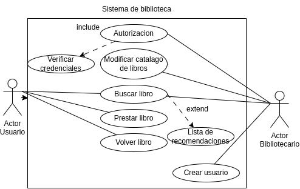

# Casos de uso de una biblioteca

## Especificacion de los actores

**Actor**| **Administrador**
---|---|
Descripción|Gestion de la biblioteca
Relaciones|Usuario (Buscar libro)
Referencias|Autorizacion, modificacion del catalago, buscar libro, crear ususario
Autor|Inna Vdovitsyna
Fecha|23/01/24

**Actor**| **Usuario**
---|---|
Descripción|Gestion de la biblioteca
Relaciones|Usuario (Buscar libro)
Referencias|Buscar libro, Prestar libro, Volver libro
Autor|Inna Vdovitsyna
Fecha|23/01/24

## Especificacion de los casos de uso

**Caso de Uso CU**|**Autorizacion**
---|----
Fuentes|Diagrama de los casos de uso
Actor|Bibliotecario
Descripción|Autorizarse en el sistema de biblioteca para gestionar el trabajo de la biblioteca
**Flujo básico**|
1|Abrir el sistema
2|Introducir el nombre y contraseña
**Flujo alternativo**|
2 |Si el nombre de usuario o la contraseña son incorrectos durante la autorización:
---| Mostrar un mensaje de error. Permitir al usuario volver a ingresar la información de inicio de sesión.
Pre-condiciones|Existir la cuenta del administrador
Post-condiciones|Las acciones del administrador deberian estar disponibles
Autor|Inna Vdovitsyna
Fecha|23/01/24

**Caso de Uso CU**|**Verificar credenciales**
---|---
Fuentes|Diagrama de los casos de uso
Actor|Bibliotecario
Descripción|Verificar los datos  introducidos por usuario
**Flujo básico**|
1|Buscar la cuenta
2|Verificar el nombre
3|Comprobar la contraseña de la cuenta
**Flujo alternativo**|
3| Si la cuenta buscada no existe durante la verificación de credenciales:
---|Mostrar un mensaje de error.
---|Indicar al usuario o bibliotecario que verifique la información proporcionada.
Pre-condiciones|Existir la cuenta del administrador
Post-condiciones|Las acciones del administrador deberian estar disponibles
Notas| accion obligatorio (include)
Autor|Inna Vdovitsyna
Fecha|23/01/24

**Caso de Uso CU**|**Modificar catalogo de los libros**
--|--
Fuentes|Diagrama de los casos de uso
Actor|Bibliotecario
Descripción|Verificar los datos  introducidos por usuario
**Flujo básico**|
1|Autorizarse en el sistema
2|Añadir o borrar los libros del catalogo
**Flujo alternativo**|
2| Si el sistema no puede añadir o borrar libros del catálogo:
---|Mostrar un mensaje de error.
---|Informar al bibliotecario sobre el problema técnico.
Pre-condiciones|El catalogo de los libros debe estar creado
Post-condiciones|Catalogo de libros disponibles modificado
Autor|Inna Vdovitsyna
Fecha|23/01/24

**Caso de Uso CU**|**Prestar libro**
--|--
Fuentes|Diagrama de los casos de uso
Actor|Usuario
Descripción|Prestar libro disponible del catalogo
**Flujo básico**|
1|Buscar un libro en catalogo
2|Comprobar que libro esta disponible
3|Prestar el libro
**Flujo alternativo**|
2| Si el libro no está disponible durante el intento de préstamo:
---|Mostrar un mensaje de error.
---|Sugerir al usuario buscar otro libro o verificar la disponibilidad más tarde.
Pre-condiciones|Libro debe ser disponible
Post-condiciones|Libro y el usuario se associan 
Autor|Inna Vdovitsyna
Fecha|23/01/24

**Caso de Uso CU**|**Buscar libro**
--|--
Fuentes|Diagrama de los casos de  uso
Actor|Usuario, Bibliotecario
Descripción|Buscar en el catalogo y comprobar su estado
**Flujo básico**|
1|Buscar libro en catalago
2|Comprobar, si libro esta disponible
**Flujo alternativo**|
1| Si el libro no se encuentra durante la búsqueda:
---|Mostrar un mensaje de error.
---|Animar al usuario a revisar la ortografía o probar términos de búsqueda diferentes.
Pre-condiciones|Libro debe estar registrado en el catalogo
Post-condiciones|
Autor|Inna Vdovitsyna
Fecha|23/01/24

**Caso de Uso CU**|**Recomendar libro**
--|--
Fuentes|Diagrama de los casos de  uso
Actor|Usuario, Bibliotecario
Descripción|Proponer lista de recomendaciones
**Flujo básico**|
1|Buscar libros del mismo autor/del mismo genero/etc
2|Formar la lista de recomendaciones
3|Mostrar la lista al usuario
**Flujo alternativo**| 
2|Si no se pueden formar recomendaciones debido a la falta de asociaciones entre libros:
---|Mostrar un mensaje de error.
---|Indicar que la función de recomendación no está disponible temporalmente.
Pre-condiciones|Los libros en catalogo deben estar asociados entre si mismos
Post-condiciones|Formacion de la lista de recomendaciones
Nota|accion opcional (extend)
Autor|Inna Vdovitsyna
Fecha|23/01/24

**Caso de Uso CU**|**Volver libro**
--|--
Fuentes|Diagrama de los casos de  uso
Actor|Usuario
Descripción|Volver libro prestado por usuario
**Flujo básico**|
1|Encontrar el libro en la lista de libros prestados por usuario
2|Eliminar el libro de esta lista
**Flujo alternativo**|
1|Si el usuario intenta devolver un libro que no ha prestado:
---|Mostrar un mensaje de error.
---|Indicar que solo se pueden devolver los libros prestados por el mismo usuario.
Pre-condiciones|El libro debe estar prestado por el mismo usuario que lo vuelve
Post-condiciones|El libro desaparece de la lista de libros prestados
Autor|Inna Vdovitsyna
Fecha|23/01/24

