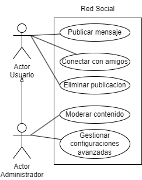

# Casos de Uso Red Social

## Especificacion de los actores
Actor|Usuario
---|---
Descripción|El actor Usuario representa a los individuos que utilizan la aplicación de red social. Estos usuarios participan en diversas acciones, como publicar mensajes, conectarse con amigos y gestionar su perfil en la plataforma.
Relaciones|Administrador
Referencias|Publicar Mensaje, Conectar con Amigos, Eliminar Publicación
Autor|Inna Vdovitsyna
Fecha|27/01/2024

Actor|Administrador
---|---
Descripción|El actor Administrador representa a los usuarios con privilegios elevados que supervisan y gestionan la plataforma de red social. Estos administradores tienen acceso a funciones avanzadas para garantizar la seguridad y el buen funcionamiento del sistema.
Relaciones|Usuario
Referencias|Moderar Contenido, Gestionar Configuraciones Avanzadas
Autor|Inna Vdovitsyna
Fecha|27/01/2024

## Especificacion de los casos de uso
Caso de Uso CU|Publicar Mensaje
---|---
Fuentes|Diagrama de los casos de uso
Actor|Usuario, Administrador
Descripción|Este caso de uso permite a los usuarios publicar mensajes y actualizaciones en su perfil de la red social.
Flujo básico|
1|El usuario accede a la aplicación con sus credenciales.
2|Selecciona la opción "Publicar Mensaje".
3|Redacta y envía el mensaje.
4|El mensaje se publica en su perfil y se muestra en el feed de sus seguidores.
Flujo Alternativo |
3|Si la publicación no se puede completar:
---|Muestra un mensaje de error indicando la naturaleza del problema.
---|Proporciona opciones para corregir el error o intentar nuevamente.
Pre-condiciones|El usuario debe estar autenticado en la aplicación.
Post-condiciones|El mensaje se publica en el perfil del usuario y se distribuye a sus seguidores.
Autor|Inna Vdovitsyna
Fecha|27/01/2024

Caso de Uso CU|Conectar con Amigos
---|---
Fuentes|Diagrama de los casos de uso
Actor|Usuario, Administrador
Descripción|Este caso de uso permite a los usuarios conectar con amigos en la red social, ampliando así su red de contactos y facilitando la interacción.
Flujo básico|
1|El usuario accede a la aplicación con sus credenciales.
2|Selecciona la opción "Conectar con Amigos".
3|Busca amigos por nombre de usuario o importa contactos desde otras plataformas.
4|Envía solicitudes de amistad y acepta las solicitudes recibidas.
Flujo Alternativo|
4|Si no se pueden enviar o recibir solicitudes:
---|Muestra un mensaje de error indicando la naturaleza del problema.
---|Proporciona opciones para corregir el error o intentar nuevamente.
Pre-condiciones|El usuario debe estar autenticado en la aplicación.
Post-condiciones|El usuario conecta con amigos y amplía su red de contactos.
Autor|Inna Vdovitsyna
Fecha|27/01/2024

Caso de Uso CU|Eliminar Publicación
---|---
Fuentes|Diagrama de los casos de uso
Actor|Usuario, Administrador
Descripción|Este caso de uso permite a los usuarios eliminar publicaciones previamente realizadas en su perfil.
Flujo básico|
1|El usuario accede a la aplicación con sus credenciales.
2|Navega a la publicación que desea eliminar en su perfil.
3|Selecciona la opción "Eliminar Publicación".
4|Confirma la acción de eliminación.
Flujo Alternativo|
4|Si la publicación no se puede eliminar:
---|Muestra un mensaje de error indicando la naturaleza del problema.
---|Proporciona opciones para corregir el error o intentar nuevamente.
Pre-condiciones|El usuario debe estar autenticado en la aplicación,la publicación que se desea eliminar debe pertenecer al usuario.
Post-condiciones|La publicación se elimina del perfil del usuario.
Autor|Inna Vdovitsyna
Fecha|27/01/2024

Caso de Uso CU|Moderar Contenido
---|---
Fuentes|Diagrama de los casos de uso
Actor|Administrador
Descripción|Este caso de uso permite al administrador moderar el contenido de la red social, asegurando que se cumplan las normas y directrices de la plataforma.
Flujo básico|
1|El administrador accede a la aplicación con sus credenciales.
2|Selecciona la opción "Moderar Contenido".
3|Visualiza una lista de publicaciones reportadas por usuarios u otras detecciones automáticas.
4|Evalúa el contenido y decide si es apropiado o debe ser eliminado.
5|Toma medidas, como eliminar publicaciones, advertir a usuarios o desactivar cuentas, según la gravedad del contenido.
Flujo Alternativo|
5|Si no se puede moderar el contenido:
---|Muestra un mensaje de error indicando la naturaleza del problema.
---|Proporciona opciones para corregir el error o solicitar asistencia técnica.
Pre-condiciones|El administrador debe tener credenciales de administrador válidas, debe existir contenido reportado o detectado para moderar.
Post-condiciones|Las acciones de moderación quedan registradas en el sistema.
Autor|Inna Vdovitsyna
Fecha|27/01/2024

Caso de Uso CU|Gestionar Configuraciones Avanzadas
---|---
Fuentes|Diagrama de los casos de uso
Actor|Administrador
Descripción|Este caso de uso permite al administrador gestionar configuraciones avanzadas de la red social para adaptar la plataforma a las necesidades y políticas específicas.
Flujo básico|
1|El administrador accede a la aplicación con sus credenciales.
2|Selecciona la opción "Configuraciones Avanzadas".
3|Accede a una interfaz que permite modificar opciones como políticas de privacidad, límites de contenido y configuraciones de seguridad.
4|Realiza las modificaciones necesarias y guarda los cambios.
Flujo Alternativo|
4|Si no se pueden guardar las configuraciones:
---|Muestra un mensaje de error indicando la naturaleza del problema.
---|Proporciona opciones para corregir el error o solicitar asistencia técnica.
Pre-condiciones|El administrador debe tener credenciales de administrador válidas.
Post-condiciones|Las configuraciones avanzadas quedan actualizadas en el sistema.
Autor|Inna Vdovitsyna
Fecha|27/01/2024