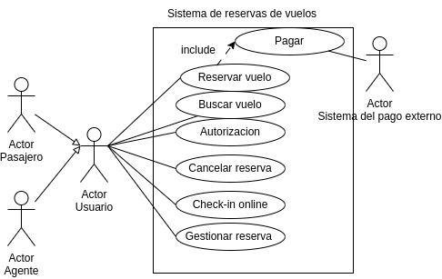

# Casos de Uso Reserva de vuelos 

## Especificacion de los actores

# Casos de Uso Reserva de vuelos 

## Especificacion de los actores

## Especificacion de los casos de uso

**Caso de Uso CU**|**Buscar vuelo**
--|--
Fuentes| Diagrama de los casos de uso
Actor|Pasajero
Descripción|Búsqueda de vuelos por parte de un pasajero.
Flujo básico| Pasajero accede al sistema, Selecciona "Buscar Vuelo", Ingresa criterios de búsqueda, Sistema muestra resultados, Pasajero selecciona vuelo, Sistema muestra detalles del vuelo
Pre-condiciones|Pasajero autenticado, sistema tiene información de vuelos.
Post-condiciones|Sistema registra búsqueda del pasajero, muestra resultados al pasajero
Autor|Inna Vdovitsyna
Fecha|23/01/2024

**Caso de Uso CU**|**Reserva**
--|--
Fuentes| Diagrama de los casos de uso
Actor|Pasajero
Actor|Pasajero
Descripción|Reserva de Vuelo
Flujo básico|Pasajero accede al sistema, Selecciona "Buscar Vuelo", Ingresa criterios de búsqueda, Sistema muestra resultados, Pasajero selecciona vuelo, Sistema muestra detalles del vuelo, Pasajero selecciona "Reservar Vuelo", Sistema solicita confirmación, Pasajero confirma la reserva, Sistema confirma la reserva al pasajero
Pre-condiciones|Pasajero autenticado, sistema tiene información de vuelos
Post-condiciones|Sistema registra la reserva del pasajero, genera un número de reserva
Autor|Inna Vdovitsyna
Fecha|23/01/2024

**Caso de Uso CU**|**Check-in**
--|--
Fuentes| Diagrama de los casos de uso
Actor|Pasajero
Descripción|Check-in de Vuelo
Flujo básico|Pasajero accede al sistema, Selecciona "Consultar Reservas", Sistema muestra las reservas del pasajero, Pasajero selecciona la reserva para hacer check-in, Sistema muestra detalles de la reserva, Pasajero selecciona "Realizar Check-in", Sistema solicita confirmación de check-in, Pasajero confirma el check-in, Sistema emite tarjeta de embarque y actualiza el estado del check-in
Pre-condiciones|Pasajero autenticado, pasajero tiene al menos una reserva con check-in disponible
Post-condiciones|Sistema emite tarjeta de embarque, actualiza el estado del check-in
Autor|Inna Vdovitsyna
Fecha|23/01/2024

**Caso de Uso CU**|**Gestionar Reserva**
--|--
Fuentes| Diagrama de los casos de uso
Actor|Agente de Reservas
Descripción|Gestionar Reserva
Flujo básico|Agente de Reservas accede al sistema, Selecciona "Gestionar Reservas", Sistema muestra la lista de reservas pendientes, Agente selecciona una reserva para gestionar, Sistema muestra detalles de la reserva, Agente realiza operaciones de gestión (modificar detalles, asignar asientos, etc.), Sistema confirma las modificaciones y actualiza la reserva
Pre-condiciones|Agente de Reservas autenticado, existencia de al menos una reserva pendiente de gestión.
Post-condiciones|Sistema actualiza la reserva según las modificaciones realizadas por el agente
Autor|Inna Vdovitsyna
Fecha|23/01/2024

**Caso de Uso CU**|**Cancelar Reserva**
--|--
Fuentes| Diagrama de los casos de uso
Actor|Pasajero
Descripción|Cancelar Reserva
Flujo básico|Pasajero accede al sistema, Selecciona "Consultar Reservas",Sistema muestra las reservas del pasajero, Pasajero selecciona la reserva a cancelar, Sistema muestra detalles de la reserva, Pasajero selecciona "Cancelar Reserva", Sistema solicita confirmación, Pasajero confirma la cancelación, Sistema cancela la reserva y actualiza el estado
Pre-condiciones|Pasajero autenticado, pasajero tiene al menos una reserva activa
Post-condiciones|Sistema cancela la reserva seleccionada
Autor|Inna Vdovitsyna
Fecha|23/01/2024

**Caso de Uso CU**|**Autorización**
--|--
Fuentes| Diagrama de los casos de uso
Actor|Usuario del Sistema
Descripción|Autorización de Usuario en el Sistema
Flujo básico|Usuario intenta acceder a funciones que requieren autorización, Sistema verifica la identidad del usuario, Si el usuario está autenticado, se le concede autorización, Si no está autenticado, se le solicita iniciar sesión, Usuario proporciona credenciales de inicio de sesión, Sistema verifica las credenciales y concede o niega la autorización, Si la autorización es concedida, el usuario puede acceder a las funciones
Pre-condiciones|Usuario intenta acceder a funciones que requieren autorización, usuario autenticado o dispuesto a iniciar sesión.
Post-condiciones|Usuario autorizado para acceder a las funciones solicitadas
Autor|Inna Vdovitsyna
Fecha|23/01/2024

**Caso de Uso CU**|**Pagar**
--|--
Fuentes| Diagrama de los casos de uso
Actor|Pasajero
Descripción|Proceso de Pago de Reserva
Flujo básico|Pasajero confirma la reserva de vuelo, Sistema presenta las opciones de pago, Pasajero selecciona el método de pago (tarjeta de crédito, PayPal, etc.), Sistema solicita la información de pago al pasajero, Pasajero proporciona la información requerida, Sistema verifica la validez de la información de pago, Si la verificación es exitosa, se procesa el pago, Sistema genera un recibo de pago y lo presenta al pasajero, Pasajero recibe confirmación de la reserva y el pago
Pre-condiciones|Pasajero ha confirmado la reserva, sistema tiene opciones de pago configuradas
Post-condiciones|Reserva marcada como pagada, generación de un recibo de pago
Autor|Inna Vdovitsyna
Fecha|23/01/2024
