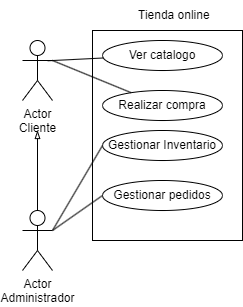

# Casos de Uso Reserva de vuelos 

## Especificacion de los actores

Actor|Cliente
---|---
Descripción|El actor Cliente representa a los usuarios finales que interactúan con la tienda en línea. Estos usuarios realizan acciones como explorar el catálogo, realizar compras y gestionar su cuenta en el sistema.
Relaciones|Administrador
Referencias|Realizar Compra, Ver Catálogo
Autor|Inna Vdovitsyna
Fecha|27/01/2024

Actor|Administrador
---|---
Descripción|El actor Administrador representa a los usuarios con privilegios elevados que gestionan el sistema de la tienda en línea. Estos usuarios tienen acceso a funciones de administración, como gestionar inventario, revisar pedidos y mantener el sistema en funcionamiento.
Características|Accede al sistema con credenciales de administrador, Gestionar el inventario de productos, Supervisar y gestionar pedidos,Acceder a funciones de administración avanzadas.
Relaciones|Cliente
Referencias|Gestionar Inventario, Gestionar Pedidos, Autorización
Autor|Inna Vdovitsyna
Fecha|27/01/2024

## Especificacion de los casos de uso
Caso de Uso CU|Ver Catálogo
---|---
Fuentes|Diagrama de los casos del uso
Actor|Cliente, Adninistrador
Descripción|Este caso de uso permite al cliente visualizar los productos disponibles en el catálogo de la tienda en línea.
**Flujo básico**|
1|El cliente accede al sistema.
2|Selecciona la opción "Ver Catálogo".
3|El sistema muestra la lista de productos disponibles.
**Flujo Alternativo**|
2|Si el catálogo está vacío:
---|El sistema muestra un mensaje indicando que no hay productos disponibles en este momento.
---|Sugiere al cliente volver a intentarlo más tarde o explorar otras secciones.
Pre-condiciones|El cliente debe estar autenticado en el sistema.
Post-condiciones|El cliente visualiza el catálogo de productos.
Autor|Inna Vdovitsyna
Fecha|27/01/2024

Caso de Uso CU|Realizar Compra
---|---
Fuentes|Diagrama de los casos del uso
Actor|Cliente, Adninistrador
Descripción|Este caso de uso permite al cliente realizar la compra de productos en la tienda en línea.
**Flujo básico**|
1|El cliente accede al sistema.
2|Explora el catálogo y selecciona productos.
3|Agrega productos al carrito de compras.
4|Realiza el pago.
5|El sistema registra la compra y actualiza el inventario.
**Flujo Alternativo**|
4|Si el sistema no puede procesar el pago:
---|Muestra un mensaje de error indicando que el pago no pudo ser completado.
---|Proporciona opciones para revisar la información de pago o utilizar otro método.
Pre-condiciones|El cliente debe estar autenticado en el sistema, el catálogo debe tener productos disponibles.
Post-condiciones|Se registra la compra y se actualiza el inventario.
Autor|Inna Vdovitsyna
Fecha|27/01/2024

Caso de Uso CU|Gestionar Inventario
---|---
Fuentes|Diagrama de los casos del uso
Actor|Administrador
Descripción|Este caso de uso permite al administrador gestionar el inventario de productos de la tienda en línea. El administrador puede realizar acciones como agregar nuevos productos, actualizar detalles de productos existentes o eliminar productos del inventario.
**Flujo básico**|
1|El administrador accede al sistema con credenciales de administrador.
2|Selecciona la opción "Gestionar Inventario".
3|Visualiza la lista de productos existentes en el inventario.
4|Puede realizar acciones como agregar nuevos productos, actualizar detalles o eliminar productos.
**Flujo Alternativo**|
4|Si el sistema encuentra un error al intentar gestionar el inventario:
---|Muestra un mensaje de error indicando la naturaleza del problema.
---|Proporciona detalles sobre cómo corregir el error o solicitar asistencia técnica.
Pre-condiciones|El administrador debe tener credenciales de administrador válidas, deben existir productos en el inventario.
Post-condiciones|Los cambios realizados en el inventario quedan registrados en el sistema.
Autor|Inna Vdovitsyna
Fecha|27/01/2024

Caso de Uso CU|Gestionar Pedidos
---|---
Fuentes|Diagrama de los casos del uso
Actor|Administrador
Descripción|Este caso de uso permite al administrador gestionar los pedidos realizados por los clientes.
**Flujo básico**|
1|El administrador accede al sistema con credenciales de administrador.
2|Selecciona la opción "Gestionar Pedidos".
3|Visualiza la lista de pedidos pendientes.
4|Puede marcar pedidos como enviados, ver detalles de los pedidos, etc.
**Flujo Alternativo**|
4|Si el sistema encuentra un error al intentar gestionar los pedidos:
---|Muestra un mensaje de error indicando la naturaleza del problema.
---|Proporciona detalles sobre cómo corregir el error o solicitar asistencia técnica.
Pre-condiciones|El administrador debe tener credenciales de administrador válidas, deben existir pedidos pendientes en el sistema.
Post-condiciones|Los cambios realizados en la gestión de pedidos quedan registrados en el sistema.
Autor|Inna Vdovitsyna
Fecha|27/01/2024
